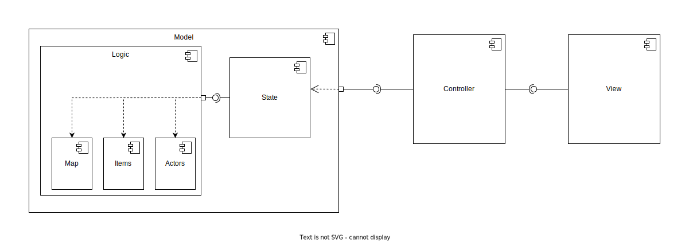

## Участники группы

* Носивской Владислав
* Саврасов Михаил
* Левин Лев

## Диаграмма компонент

## Диаграмма классов

# Описание архитектуры

## Компоненты

Используется MVC-паттерн. Model, View и Controller это отдельные компоненты. Model и View не знают друг про друга.

Model содержит всю игровую логику и содержит следующие подкомпоненты:

`State` -- Содержит всю основную информацию про текущее состояние игры. Поле игры, 
главного персонажа, мобов, которые расположены на карте, а также объект, управляющий временем.

Взаимодействие Controller и Model происходит через `State`.

`Logic` -- компонента внутри Model, содержит всю логику игры.

Внутри `Logic` есть три подкомпоненты -- `Map`, `Items`, `Actors`

`Map` содержит все классы, которые связаны с полем игры. Например, класс для генерации
комнат или класс-тайл.

`Items` содержит связанные с предметами классы. Например, инвентарь и эффекты от предметов.

`Actors` содержит связанные с персонажами классы. Главного героя, мобов, а также стратегии NPC

## Классы Controller

### Main

Содержит основной цикл, который обращается к `Model` и просит подвинуть время на один тик вперед.

Получает от `Model` все изменения, которые влияют на отображение и передает их в `UI`

### Keyboard Handler

Ожидает пользовательский ввод и выбирает, за что дернуть `Model`, в зависимости от нажатой клавиши.

## Классы View

### UI

Занимается отрисовкой карты и анимаций

### SpriteHandler

Загружает спрайты из файлов

## Классы Model-Logic-Map

### Tile

Хранит информацию о конкретном тайле на поле. Хранит информацию о том, есть ли на тайле какой-либо персонаж, есть ли эффект
на тайле (например, горение), есть ли на тайле предмет, а также тип тайла (непроходимый/проходимый)

### Map

Хранит текущее поле тайлов. Умеет двигать персонажей внутри поля, выдавать кратчайший путь от одной клетки до другой.

### MapGenerator

Генерирует новые карты 

### MapLoader

Загружает негенерируемые карты из файлов

## Классы Model-Logic-Actors

### Actor

Интерфейс для любых персонажей

Хранит основные характеристики, инвентарь (у мобов считаем, что тоже есть инвентарь, чтобы можно было
добавить механику дропа), наложенные эффекты, позицию на поле.

### MainCharacter

Класс главного героя. Хранит текущий опыт, который влияет на получение новых уровней.

### Mob

Класс NPC. Хранит стратегию, согласно которой действует

### Strategy

Интерфейс для стратегий

### ConcreteStrategy1, ConcreteStrategy2

Конкретные реализации стратегий. Например, агрессивная стратегия, мирная стратегия, более сложные стратегии.

## Классы Model-Logic-Items

### Inventory

Хранит предметы из рюкзака и надетые сейчас предметы.

Умеет надевать и снимать предметы.

### Item

Предмет, характеризуется набором эффектов, которые накладывает

### Effect

Эффект. Имеет некоторые действия для старта (например, добавляет здоровье), действия для конца (например, обратно 
отнимает здоровье) и применение (например, кровотечение примяняется раз в некоторое число тиков и отнимает здоровье)

### Effect1, Effect2

Конкретные реализации эффектов. Можно переопределить только часть действий, например, можно переопределить только 
эффект для старта (перманентный бафф).

## Классы Model-Environment

### Environment

Класс, хранящий среду. Карту, персонажа, мобов, планировщик времени

### Timer

Управляет временем. Хранит текущее время и очередь событий, которые нужно обработать. Событие это, например, наложение эффекта.
При прибавлении времени на единицу вынимает все события, которые должны произойти в этот момент и применяет их.

### ModelHandler

Класс, с которым взаимодействует контроллер. Обрабатывает действия пользователя, а также на каждый тик двигает время у среды.
